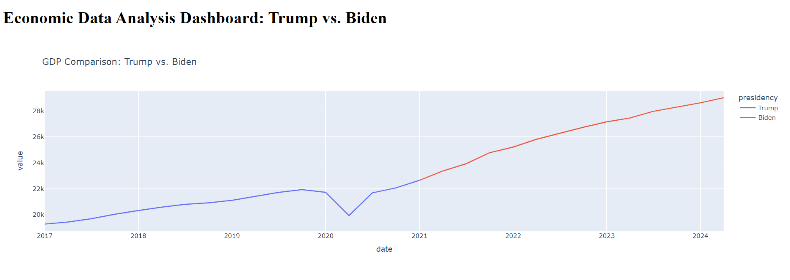
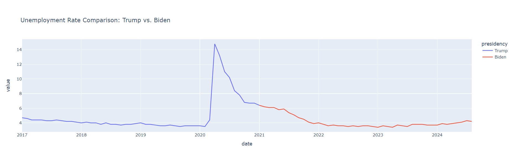
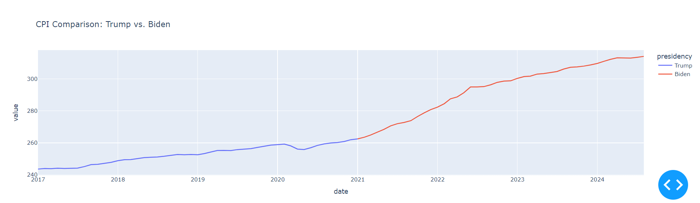

# Economic Data Analysis Dashboard: Trump's Presidency vs. Biden's Presidency

## Overview

This project compares key U.S. economic indicators—**GDP**, **Unemployment Rate**, and **CPI (Inflation)**—between the Trump and Biden presidencies. Using data from the [FRED API](https://fred.stlouisfed.org/), the project extracts, cleans, stores, and visualizes this data in an interactive dashboard. The project demonstrates key data analytics skills in **Python**, **SQL**, **Dash/Plotly**, and **PostgreSQL**.

## Project Structure

```
/economic-dashboard
│
├── data_ingestion/
│   └── fetch_data.py                  # Python script to fetch data from FRED API
│
├── database/
│   └── create_tables.sql              # SQL script to create tables in the PostgreSQL database
│   └── queries.sql                    # SQL queries for data analysis
│
├── data_processing/
│   └── clean_data.py                  # Python script to clean and preprocess data
│
├── dashboard/
│   └── app.py                         # Dash app to create an interactive dashboard
│
├── notebooks/
│   └── analysis_notebook.ipynb         # Jupyter notebook for data analysis
│
└── README.md                          # Documentation for the project
```

## Data Sources

- **Gross Domestic Product (GDP)**: Retrieved from FRED.
- **Unemployment Rate (UNRATE)**: Retrieved from FRED.
- **Consumer Price Index (CPI)**: Retrieved from FRED.

Data is gathered from the [Federal Reserve Economic Data (FRED)](https://fred.stlouisfed.org/) API using the `fetch_data.py` script.

## Features

- **Data Ingestion**: Fetches raw economic data from FRED API using Python and saves the data as JSON files.
- **Database Management**: Stores the cleaned data in a **PostgreSQL** database for structured querying and analysis.
- **Data Processing**: Python scripts clean and transform the data for analysis.
- **Interactive Dashboard**: Built using **Dash/Plotly**, providing real-time comparison of key economic indicators between Trump's and Biden's presidencies.
- **Analysis Notebook**: A Jupyter notebook (`analysis_notebook.ipynb`) performs statistical and visual analysis, summarizing trends in the data.

## Setup Instructions

### 1. Clone the repository
```bash
git clone https://github.com/junelus/economic-dashboard.git
cd economic-dashboard
```

### 2. Install dependencies
```bash
pip install -r requirements.txt
```

### 3. Set up PostgreSQL database

- Make sure you have **PostgreSQL** installed on your system.
- Create a database for the project:
  
```bash
sudo -i -u postgres
createdb economic_dashboard
```

- Run the SQL script to create the necessary tables:

```bash
psql -d economic_dashboard -f database/create_tables.sql
```

### 4. Get your FRED API key

- Register for an API key at the [FRED API Key](https://fred.stlouisfed.org/) page.
- Add your API key to the `fetch_data.py` script:
  
```python
API_KEY = 'your_fred_api_key_here'
```

### 5. Fetch data from FRED API

Run the Python script to fetch data for Trump's and Biden's presidencies:

```bash
python data_ingestion/fetch_data.py
```

This will store the fetched data in JSON format in the `data` folder.

### 6. Load data into PostgreSQL

Run the Python script to clean the data and load it into PostgreSQL:

```bash
python data_processing/clean_data.py
```

### 7. Run the Dashboard

Run the Dash app to launch the interactive dashboard:

```bash
python dashboard/app.py
```

Open your web browser and navigate to `http://127.0.0.1:8050/` to interact with the dashboard.

### 8. Explore the Data with the Jupyter Notebook

Open the analysis notebook (`analysis_notebook.ipynb`) to perform deeper analysis:

```bash
jupyter notebook notebooks/analysis_notebook.ipynb
```

## Key Visualizations

The dashboard provides the following key visualizations for comparing Trump's and Biden's presidencies:

- **GDP Comparison**: A time series of U.S. GDP during both presidencies.
- **Unemployment Rate Comparison**: A comparison of unemployment trends.
- **CPI Comparison**: A visual comparison of inflation rates.

Example visualizations include rolling averages to smooth trends and highlight economic differences between the two administrations.

## Conclusion

Based on the analysis of the GDP, unemployment rate, and CPI data between Trump's and Biden's presidencies, we observe the following:
- **GDP**: Biden's term saw stronger initial GDP recovery due to post-pandemic stimulus, but growth slowed in 2022 as inflationary pressures and tighter monetary policies took effect. Trump's term had stable growth pre-COVID, but a sharp contraction during the pandemic.
- **Unemployment Rate**: Both administrations oversaw historically low unemployment rates pre-pandemic (Trump) and post-pandemic recovery (Biden). Biden's term has featured a significant decline in unemployment as the economy rebounded. 
- **CPI (Inflation)**: Trump's presidency experienced stable, low inflation, while Biden’s term has been marked by higher inflation due to various factors, though it began to ease by late 2023.
-
-
-

Further economic analysis might involve forecasting future trends using statistical models such as **ARIMA** or **linear regression**.

## Contact

For any questions, feel free to reach out via [JimmyUnelus@gmail.com](mailto:JimmyUnelus@gmail.com).
